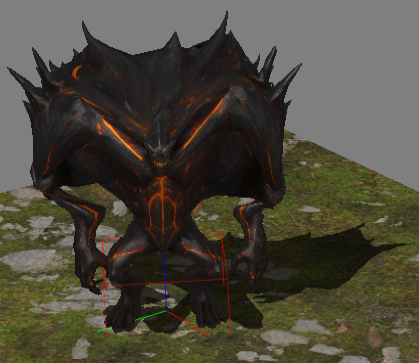
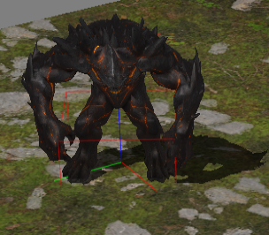

# Case 4 — Floating-Point Determinism, Compiler Flags and Precision Tradeoffs

## Overview

This case explores one of the most underestimated sources of instability in real-time systems:

> Floating-point precision behavior across compiler configurations.

We demonstrate how a simple change in floating-point optimization flags can completely deform an animated model, despite using identical source code.

This chapter covers:

- Differences between `/fp:fast` and `/fp:strict`
- Why animation systems are especially sensitive
- Float vs double vs long double behavior across platforms
- SIMD parameter passing with `XMVECTOR`
- Half-precision (16-bit) floating-point implementation in C++
- When half precision improves performance — and when it becomes catastrophic

---

## Visual Demonstration — Fast vs Strict

Below is the exact same animation frame and zoom scale compiled under two different floating-point models.

### Compiled with `/fp:fast`

In this configuration the compiler:

- Reorders floating-point expressions
- Contracts multiply-add into FMA
- Assumes absence of NaN/Inf
- May flush denormals to zero
- Ignores signed zero semantics

**The result: accumulated numerical drift in hierarchical bone transformations.**



### Compiled with `/fp:strict`

In strict mode:

- IEEE 754 semantics are respected
- No unsafe reordering
- No implicit contraction
- Stable evaluation order

**The animation remains coherent and free from deformation.**



---

## Why does this happen?

Floating-point arithmetic is not associative.

This means:

```cpp
(a + b) + c != a + (b + c)
```

Similarly:

```cpp
(a * b) + c
```

May become:

```cpp
fma(a, b, c)
```

when fast math is enabled.

Animation systems are especially sensitive because:

- Bone matrices multiply hierarchically
- Small errors propagate multiplicatively
- Quaternion normalization accumulates drift
- Orthogonality degrades over time

**A single rounding difference in an early bone affects the entire skeleton chain.**

---

## The Only Truly Stable Values

In **IEEE 754** arithmetic, only the following values are mathematically exact:

- `0.0`
- `+∞`
- `-∞`
- `NaN` (symbolically exact)

Every other floating-point number is an approximation.

Precision loss comes from:

- Limited mantissa width
- Rounding mode
- FMA contraction
- Implicit casts
- Optimization flags
- Intermediate register precision

---

## `float` vs `double` vs `long double`

### `float` (32-bit)

```cpp
sizeof(float) == 0x4
```

- 23-bit mantissa
- ~7 decimal digits precision
- Exact integers up to 2²⁴

Used in:

- GPU pipelines
- Vertex buffers
- Most real-time math

### `double` (64-bit)

```cpp
sizeof(double) == 0x8
```

- 52-bit mantissa
- ~15–16 decimal digits precision
- Exact integers up to 2⁵³

More stable for:

- World-space coordinates
- Camera systems
- Large environments
- Accumulation loops

### `long double`

Platform-dependent behavior:

**On Windows (MSVC / MS ABI)**

```cpp
sizeof(long double) == 0x8
```

It is identical to `double`.

Reason:

- The Microsoft ABI does not support 80-bit extended precision.
- Modern Windows targets SSE2+ exclusively.
- x87 extended precision is not preserved.

**On Linux (GCC / Clang, Itanium ABI)**

```cpp
sizeof(long double) == 0x10
```

Often implemented as:

- 80-bit extended precision padded to 16 bytes
- Or true 128-bit depending on platform

**This difference alone can cause cross-platform floating-point mismatches.**

---

## SIMD and Parameter Passing (DirectXMath Case)

When using DirectXMath:

```cpp
void Update(XMVECTOR v);
```

The value is passed directly in XMM registers.

But:

```cpp
void Update(const XMVECTOR& v);
```

Now it is passed as a pointer in a general-purpose register (e.g., `RCX`), forcing memory access.

Consequences:

- Possible performance penalty
- Loss of direct register utilization
- Different code generation pattern

For small SIMD types, passing by value is often faster.

---

## Half Precision (binary16)
#### Data type `half` in DirectX and OpenGL, and `float16_t` in Vulkan

IEEE 754 `half`-precision structure:

- 1 sign bit
- 5 exponent bits
- 10 mantissa bits

Approximate range:

```cpp
±65504
```

Precision:
- ~3 decimal digits

### Efficient Half Implementation in C++

C++ does not natively support half precision (except via extensions).
A typical implementation stores raw bits:

```cpp
struct half
{
    std::uint16_t wBits;

    half() = default;
    explicit half(float f);
    operator float() const;
};
```

Design approach:

- Store as `std::uint16_t`
- Convert to/from `float` when performing arithmetic
- Implement IEEE 754 conversion logic
- Optional: omit `inf` or `NaN` support if not required

This reduces memory footprint by 50% compared to `float`.

### When Half Precision Is Beneficial

- Vertex colors
- UV coordinates
- Texture frame blending
- Particle parameters
- GPU-bound pipelines

Benefits:

- Reduced vertex buffer size
- Lower memory bandwidth
- Less PCIe transfer cost
- Improved cache locality
- Higher vertex throughput

**In large meshes, this can significantly reduce pipeline pressure.**

### When Half Precision Is Dangerous

- Transformation matrices
- Camera world positions
- Time accumulation
- Physics integrators
- Skeletal hierarchy math

**Error propagation in these systems is multiplicative.**

Half precision in these contexts leads to:

- Visible jitter
- Scale drift
- Bone instability
- Catastrophic deformation

---

## Engineering Takeaways

1) Floating-point is deterministic within a single compiled binary.
2) It is not guaranteed deterministic across compilers.
3) Optimization flags change arithmetic semantics.
4) Animation systems amplify rounding error.
5) Half precision is a storage optimization, not a computation precision tool.
6) Double precision should be used for accumulation-heavy systems.
7) Always test animation under strict floating-point settings.

---

## Final Conclusion

- Floating-point arithmetic is not “wrong” — it is finite.
- Compiler settings are not cosmetic — they redefine mathematical behavior.
- Precision is a design decision.
- Performance and determinism are often in tension.
- Engineering consists in knowing where each belongs.