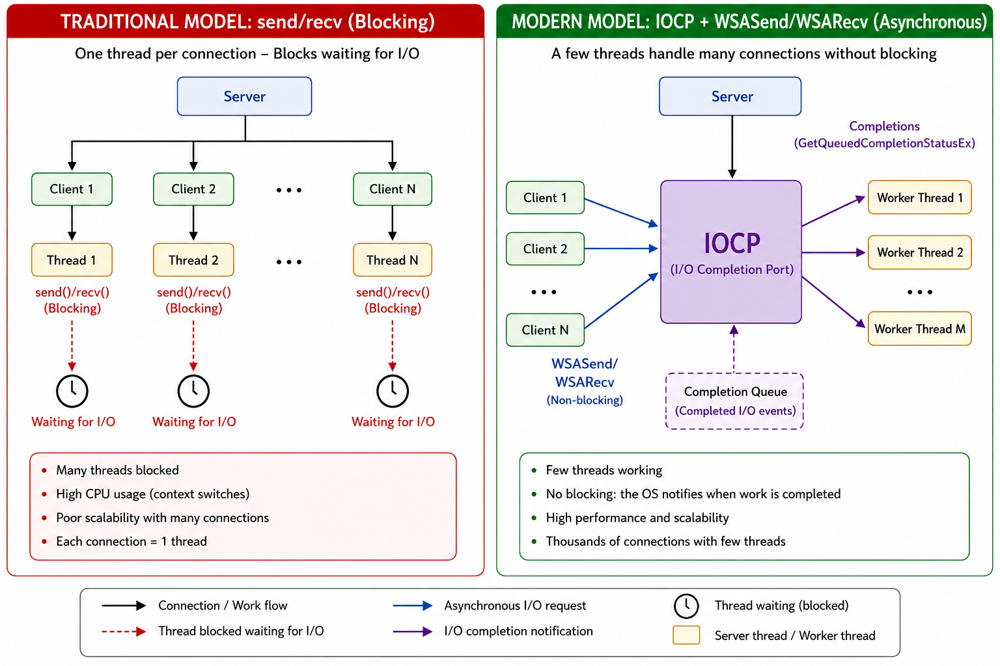

# Case 12 - Network I/O: send/recv vs WSASend/WSARecv (Overlapped Model)

## Table of Contents

- [Objective](#objective)
- [Background](#background)
- [Traditional Blocking Model](#traditional-blocking-model)
- [WSASend and WSARecv](#wsasend-and-wsarecv)
- [Threading Model Differences](#threading-model-differences)
- [Performance Considerations](#performance-considerations)

---

## Objective

To compare traditional blocking socket I/O with modern asynchronous approaches in Windows.

This case focuses on:

- `send` / `recv` (blocking model).
- `WSASend` / `WSARecv` (overlapped model).
- Scalability and threading implications.

> The key takeaway here is comparing TCP/IP network models in blocking thread mode versus overlapping thread mode. The main idea is to understand why, in production scenarios, managing a multithreaded environment for processing TCP/IP messages between client and server is absolutely essential.

> In this particular case, there is no benchmark comparison between the two systems; implementing them together is a very complex task to do in a simple example. However, we will try to give a basic idea of how both systems work, some simple examples (not necessarily functional on their own), and visual explanations of how one system works versus the other.

---

## Background

Network I/O differs significantly from file I/O.

Unlike file systems, network operations:

- Have unpredictable latency.
- Depend on external systems.
- Require handling multiple concurrent connections.

Because of this, the choice of I/O model has a major impact on performance.

> The key takeaway here is that in the vast majority of projects aiming to implement an efficient network system with multiple users and interactions, it's necessary to use an IOCP multithreading system for the Network protocol (or similar) instead of the classic `send` or `recv`. This is except in controlled environments or during debugging.

---

## Traditional Blocking Model

### Example

```cpp
SOCKET sSock = accept(...);

recv(sSock, pBuffer, nSize, 0);
send(sSock, pBuffer, nSize, 0);
```

- Simple and easy to implement.
- One thread per connection (or polling).
- Blocking behavior.

### Limitations

- Poor scalability.
- Inefficient CPU usage.
- Threads spend time waiting for I/O.

> Using the simple `send`/`recv` system can greatly simplify code implementation and make it seem "production-ready," but the reality is quite different. This system cancels thread processing when it enters "wait" mode after `send` or `recv`, increasing CPU latency.

> It's possible to use this system in a multithreaded environment, but it will never be as perfect as the IOCP system.

---

## WSASend and WSARecv

These APIs are designed for asynchronous I/O.

### Example (simplified)

```cpp
WSABUF hBuffer;
hBuffer.buf = pData;
hBuffer.len = nSize;

DWORD dwBytesSent = 0;

WSASend(sSocket, &hBuffer, 1, &dwBytesSent, 0, nullptr, nullptr);
```

> It's important to note that the pData variable must remain in memory for the system to function correctly, as the WSABUF's function is to act as a temporary control buffer to populate a circular structure within the WSA system. In my experience, keeping pData in a fixed-size, reusable global list (cache) is extremely efficient when processing these packets.

### Key Difference

Even without OVERLAPPED structures, these APIs are:

- More flexible.
- Designed for async usage.
- Compatible with advanced models (IOCP).

Overlapped I/O allows:

- Non-blocking operations.
- Multiple outstanding requests.
- Completion-based processing.

Example concept:

```cpp
WSARecv(socket, ..., &overlapped, ...);
```

Completion is handled later by the system.

```cpp
constexpr auto SERVER_REMOTE_MTU = 16384;
constexpr auto SERVER_SVR_RECEIVEMAX = 4096;

//This is a pNodeLock list, meaning it is ThreadSafe by using SRWLOCK's simple lock.
struct alignas(8) ServerIoContextHeader
{
	OVERLAPPED Overlapped;
	WSABUF WsaBuf;
	uint32_t dwClientID;
	QIO_TYPE nType;
};

struct alignas(8) ServerIoContext : ServerIoContextHeader
{
	uint8_t nBuffer[SERVER_REMOTE_MTU];
};

struct alignas(8) ServerIoContextSend : ServerIoContextHeader
{
	BlListNodeLocked<ServerIoContextSend>* pSelf;//ThreadSafe Link list for post-processing
	size_t nBytes;
	uint8_t Buffer[SERVER_SVR_RECEIVEMAX];

	ServerIoContextSend(const ServerIoContextSend& other)
	{
		XMemset(&this->Overlapped, 0x0, sizeof(OVERLAPPED));
		this->WsaBuf = other.WsaBuf;
		this->nType = QIO_SEND;
		this->dwClientID = other.dwClientID;
		this->pSelf = other.pSelf;
		XMemcpy(this->Buffer, other.Buffer, other.nBytes);
	}

	ServerIoContextSend()
	{
		XMemset(&this->Overlapped, 0x0, sizeof(OVERLAPPED));
		this->WsaBuf = {};
		this->nType = QIO_SEND;
		this->nBytes = 0;
		this->dwClientID = 0;
		this->pSelf = nullptr;
		this->Buffer[0] = 0;
	}
};

static BlBool SendWSA(ServerStrc* pServer, RemoteConnectionStrc* pConnection, BlListNodeLocked<ServerIoContextSend>* pIO)
{
	if (!pIO)
	{
		return BL_FALSE;
	}

	pIO->hData.nType = QIO_SEND;
	pIO->hData.WsaBuf.buf = reinterpret_cast<char*>(pIO->hData.Buffer);
	pIO->hData.pSelf = pIO;
	pIO->hData.dwClientID = pConnection->nClientId;

	XMemset(&pIO->hData.Overlapped, 0x0, sizeof(OVERLAPPED));
		
	DWORD dwBytes = 0;
	const int32 Error = WSASend(pConnection->hSocket, &pIO->hData.WsaBuf, 1, &dwBytes, 0, &pIO->hData.Overlapped, nullptr);
	if (Error == SOCKET_ERROR && WSAGetLastError() != WSA_IO_PENDING)
	{
		pConnection->lSendCtx.Dequeued(pIO);
		Server::CloseRemoteConnection(pServer, pConnection->nClientId);
		return BL_FALSE;
	}

	return BL_TRUE;
}

BlBool SendToClient(ServerStrc* pServer, RemoteConnectionStrc* pConn, uint8_t* pPacket, uint32_t nSize)
{
	if (!pConn || pConn->lClosing || pConn->bConnectionClosed)
	{
		return BL_FALSE;
	}

	if (nSize > SERVER_REMOTE_MTU)
	{
		return BL_FALSE;
	}

	ServerIoContextSend hIO;

	hIO.nType = QIO_SEND;

	hIO.nBytes = nSize;
	XMemcpy(hIO.Buffer, pPacket, nSize);
	hIO.WsaBuf.len = nSize;

	return SendWSA(pServer, pConn, pConn->lSendCtx.NewNodeLock(hIO));
}
```

> In this IOCP Sending structure, it is possible to observe how packets are handled globally, so that they remain in memory until the post-processing threads.

> In the server's RemoteConnection structure (Server->User) you can see how the sending context is handled, generates nodes (reusing or with new memory if necessary) and, if it cannot be sent due to disconnection, latency or any other reason, a direct dequeue is performed to reuse it.

In the case of ThreadIOCP, it is handled using OVERLAPPED_ENTRY within minwinbase.h. This structure works specifically to handle input and output of user packets simultaneously; that is, by using GetQueuedCompletionStatusEx you can obtain N number of data inputs to process (this number N depends on the server type, but can take values between 1 and 32768; note that it is the number of processing steps per iteration of ThreadIOCP).

```cpp
static DWORD ServerIocpThread(ServerStrc* pServer)
{
	OVERLAPPED_ENTRY hEntries[64] = {};
	ULONG nCount = 0;

	while (true)
	{
		const BlBool bOK = GetQueuedCompletionStatusEx(pServer->hIOCP, hEntries, ARRAYSIZE(hEntries), &nCount, INFINITE, FALSE);
		if (!bOK && GetLastError() != ERROR_OPERATION_ABORTED)
		{
			continue;
		}

		for (UINT i = 0; i < nCount; ++i)
		{
			OVERLAPPED_ENTRY* pEntry = &hEntries[i];
			if (pEntry->lpCompletionKey == SHUTDOWN_KEY)
			{
				return 0;
			}

			if (pEntry->lpCompletionKey == ACCEPT_CLIENT)
			{
				[...]
			}
		}

		ServerIoContextHeader* pIOContext = CONTAINING_RECORD(pEntry->lpOverlapped, ServerIoContextHeader, Overlapped);
		if (pIOContext->nType == QIO_RECV)
		{
			[...]
		}
		else if (pIOContext->nType == QIO_SEND)
		{
			[...]
		}
	}
}
```

When initializing the IOCP Thread, the possibility of adding more than one Thread at the same time must be considered, and the IOCP system itself handles distributing the information with internal locks.

The following example demonstrates how to initialize one or more threads for processing.

Custom commands must be used to initialize the system, initialize the client connection, send data, receive data, and close connections. Later, other commands can be created for specific situations (ping, debugging, etc.).


```cpp
BlBool Init(ServerStrc* pServer, uint16_t hPort, int32 nNumOfServers)
{
	if (!pServer || nNumOfServers < 1)
	{
		return BL_FALSE;
	}

	SOCKET sSocket = WSASocketW(AF_INET, SOCK_STREAM, IPPROTO_TCP, nullptr, 0, WSA_FLAG_OVERLAPPED);
	if (sSocket == INVALID_SOCKET)
	{
		return BL_FALSE;
	}

	int32 nFlag = 1;
	setsockopt(sSocket, IPPROTO_TCP, TCP_NODELAY, reinterpret_cast<char*>(&nFlag), sizeof(nFlag));
	setsockopt(sSocket, SOL_SOCKET, SO_KEEPALIVE, reinterpret_cast<char*>(&nFlag), sizeof(nFlag));
	setsockopt(sSocket, SOL_SOCKET, SO_REUSEADDR, reinterpret_cast<char*>(&nFlag), sizeof(nFlag));

	sockaddr_in sAddr = {};
	sAddr.sin_family = AF_INET;
	sAddr.sin_port = htons(hPort);

	if (bind(sSocket, reinterpret_cast<sockaddr*>(&sAddr), sizeof(sAddr)) == SOCKET_ERROR)
	{
		return BL_FALSE;
	}

	if (listen(sSocket, 200) == SOCKET_ERROR)
	{
		return BL_FALSE;
	}

	pServer->hSocket = sSocket;
	pServer->hIOCP = CreateIoCompletionPort(INVALID_HANDLE_VALUE, nullptr, 0, 0);

	if (!pServer->hIOCP)
	{
		return BL_FALSE;
	}

	CreateIoCompletionPort(reinterpret_cast<HANDLE>(pServer->hSocket), pServer->hIOCP, ACCEPT_CLIENT, 0);

	ASSERT(LoadAcceptEx(pServer->hSocket));

	pServer->vMultiThreadInfo.resize(nNumOfServers);
	pServer->vMultiThreadInfo.zero_mem();

	for (int32 i = 0; i < nNumOfServers; ++i)
	{
		ServerMultiThreadStrc* pThread = &pServer->vMultiThreadInfo[i];
		pThread->bThreadConnectClose = BL_FALSE;
		pThread->hThreadConnect = CreateThreadA(nullptr, 0, reinterpret_cast<LPTHREAD_START_ROUTINE>(ServerIocpThread), pServer, 0, nullptr);

		SetNextAffinityMask(pThread->hThreadConnect);
	}

	for (int32 i = 0; i < (nNumOfServers << 1); ++i)
	{
		PostAccept(pServer->hSocket, &pServer->hIOContext);
	}

	return BL_TRUE;
}

```

The `PostAccept` is initialized the connections. The number of connections does not depend on the number of threads; twice the number of threads is used by convention `(nThreads * 2)`, but you can modify this.

> Important clarification: Extended functions must be considered to properly operate the IOCP system

```cpp

BlBool LoadAcceptEx(SOCKET listenSocket)
{
	if (lpAcceptEx)
	{
		return BL_TRUE;
	}

	GUID GuidAcceptEx = WSAID_ACCEPTEX;
	DWORD dwBytes = 0;

	if (WSAIoctl(listenSocket, SIO_GET_EXTENSION_FUNCTION_POINTER, &GuidAcceptEx, sizeof(GuidAcceptEx), &lpAcceptEx, sizeof(lpAcceptEx), &dwBytes, nullptr, nullptr) == SOCKET_ERROR)
	{
		return BL_FALSE;
	}

	GUID getaddrs_guid = WSAID_GETACCEPTEXSOCKADDRS;
	if (WSAIoctl(listenSocket, SIO_GET_EXTENSION_FUNCTION_POINTER, &getaddrs_guid, sizeof(getaddrs_guid), &lpfnGetAcceptExSockaddrs, sizeof(lpfnGetAcceptExSockaddrs), &dwBytes, nullptr, nullptr) == SOCKET_ERROR)
	{
		return BL_FALSE;
	}

	return BL_TRUE;
}

static void PostAccept(SOCKET hCurrentSocket, ServerAcceptContext* pAcceptContext)
{
	pAcceptContext->hClientSocket = WSASocketW(AF_INET, SOCK_STREAM, IPPROTO_TCP, nullptr, 0, WSA_FLAG_OVERLAPPED);

	DWORD dwBytes = 0;
	const BlBool bOK = AcceptEx(hCurrentSocket, pAcceptContext->hClientSocket, pAcceptContext->pAddrBuffer, 0, sizeof(sockaddr_in) + 16, sizeof(sockaddr_in) + 16, &dwBytes, &pAcceptContext->Overlapped);

	if (!bOK && WSAGetLastError() != WSA_IO_PENDING)
	{
		closesocket(pAcceptContext->hClientSocket);
		pAcceptContext->hClientSocket = INVALID_SOCKET;
	}
}
```

> As you can see, the IOCP system is far more advanced than the classic `send`/`recv` system and requires better handling of multithreading environments. While the code examples may make the system appear very abstract, they are actually snippets of real code from the Blessing project, designed to improve computer security and system efficiency. In the case of the network system, there are two implemented systems: a classic `send`/`recv` system and the `IOCP` system. Both perform the same function; they are simply activated/deactivated by a global macro for testing purposes. Both CPU idle/lock and network usage are very high in the simpler case, while in the `IOCP` case, they are reduced to practically a permanent idle state without locking (depending on the structural implementations for adding/removing/sending/receiving/accepting connections).

## Threading Model Differences

### Blocking Model

```text
Thread = Connection
```

- Many threads required.
- Context switching overhead.
- Poor scalability.

> The choice here depends entirely on the intended use. For simple situations like debugging or administrator commands, this option is more than sufficient, and implementing IOCP for these purposes isn't worthwhile.


### Overlapped Model

```text
Thread = Worker
Work = Completed I/O
```

- Few threads handle many connections.
- Efficient scheduling.
- High scalability.

> For high-performance scenarios with multiple clients working simultaneously with a high number of requests per second, implementing an IOCP system is worthwhile. In this case, the asynchronous system wins.

### In the Example

> The main.cpp code implements the non-IOCP version to explain why the classic system scales poorly with multiple clients simultaneously. However, it is recommended to read the information on how to generate a complete IOCP system.

---

## Performance Considerations

Blocking I/O:

- Simple.
- Sufficient for small systems.

Asynchronous I/O:

- Higher complexity.
- Significantly better scalability.



> While .NET applications and libraries like Boost.Asio encapsulate the complexity of IOCP, the idea here is simply to show the internal context of the core of this process so that you can understand how the system actually works.